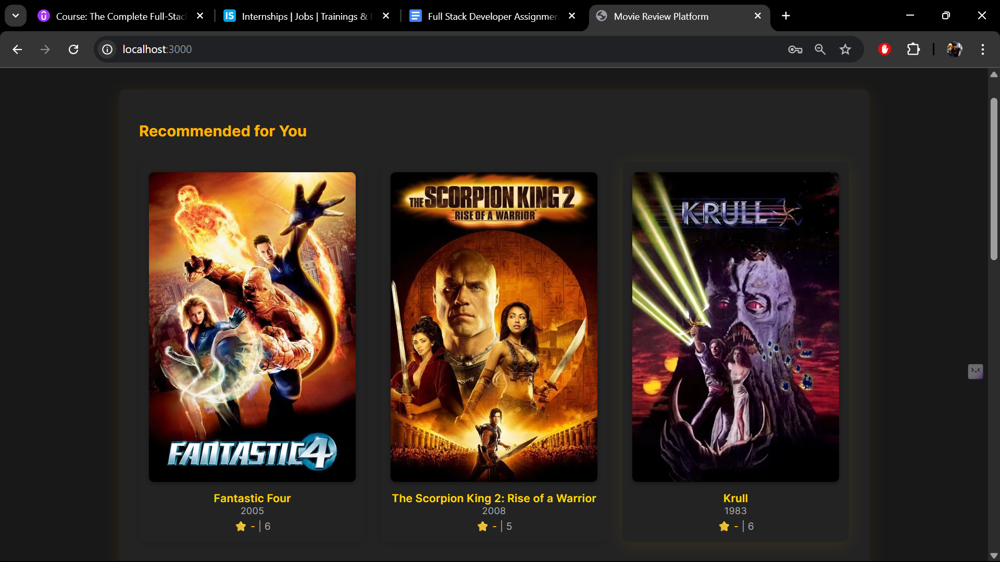
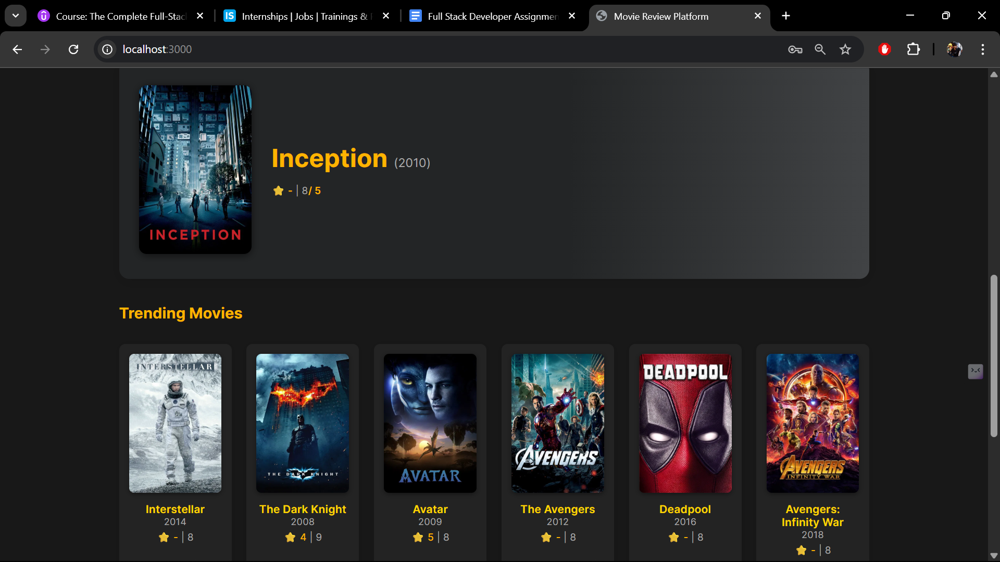
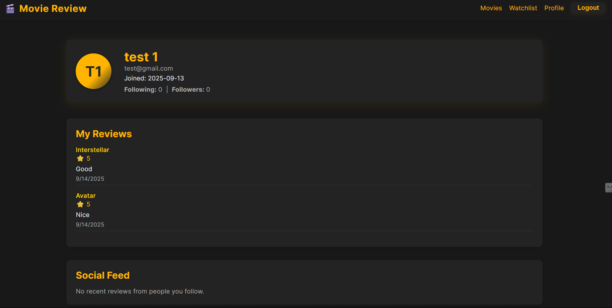
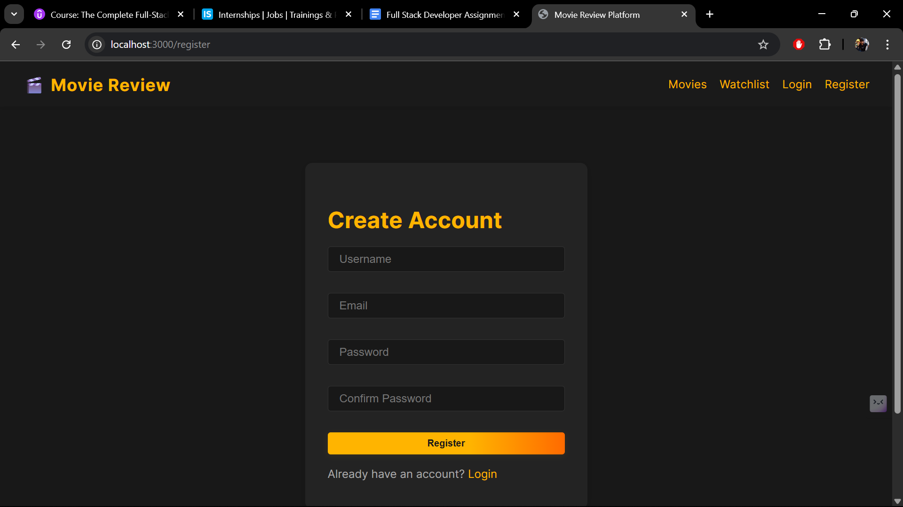
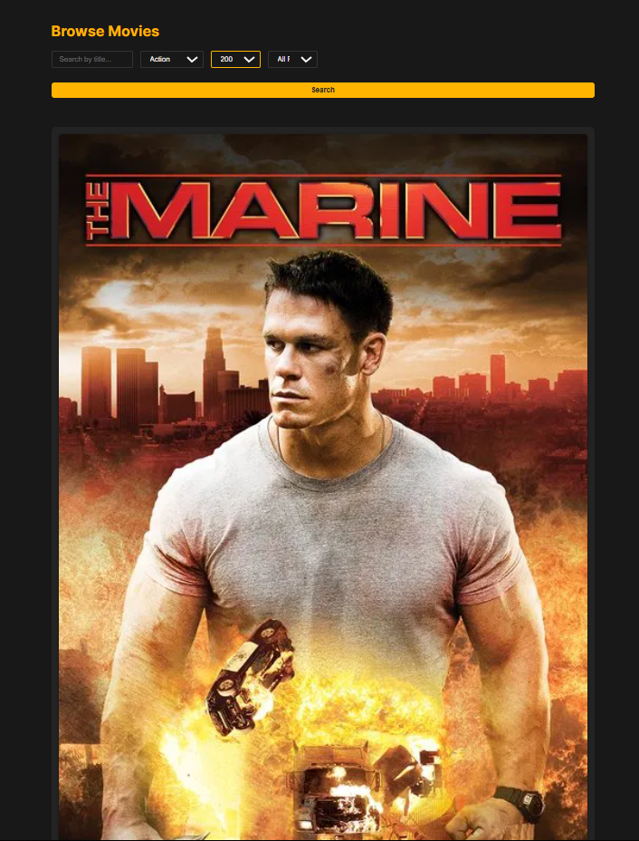
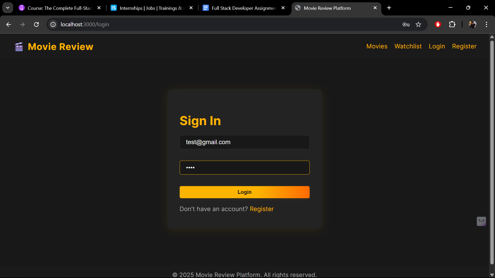
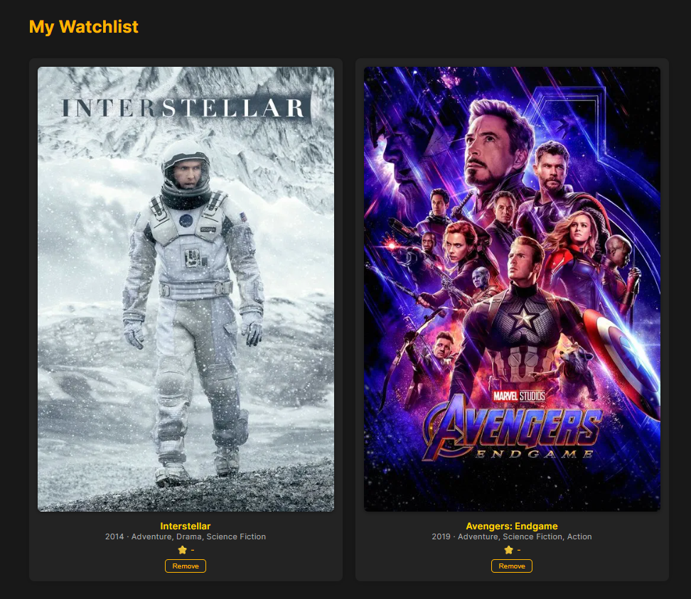

# Movie Review Platform

<p align="center">
	
</p>

A full-stack movie review platform with a modern React frontend and Node.js/Express backend using MongoDB. Designed for scalability, real-time features, and a great user experience.

---

## Features

- Browse, search, and filter movies (by title, genre, year, rating)
- Read/write reviews and rate films
- User authentication (register/login/logout)
- User profile with review history and watchlist
- Social features: follow users, see their reviews
- Movie recommendations (hybrid: user-based + content-based)
- Real-time notifications (WebSocket)
- Admin dashboard for movies/users
- RESTful API
- Responsive dark UI
- Persistent login with session timeout

---

## Tech Stack

- **Frontend:** React, Redux, React Router
- **Backend:** Node.js, Express
- **Database:** MongoDB (Mongoose)
- **Real-time:** WebSocket (ws)

---

## Setup & Installation

### 1. Clone the repository

```bash
git clone https://github.com/TheRealUjjwal/movie-review-platform.git
cd movie-review-platform
```

### 2. Database Setup

- Install and run MongoDB locally, or use MongoDB Atlas.
- Create a database (e.g., `movie_review`).
- (Optional) Import a large movie dataset:
	- Place your CSV (e.g., `TMDB_movie_dataset_v11.csv`) in `backend/`.
	- Edit `backend/import_movies.js` if needed.
	- Run:
		```bash
		cd backend
		npm install
		node import_movies.js
		```

### 3. Backend Setup

```bash
cd backend
npm install
# Create a .env file (see below)
npm run dev
# or
npm start
```

### 4. Frontend Setup

```bash
cd frontend
npm install
npm start
```

---

## Environment Variables

### Backend (`backend/.env`)

- `PORT` - Backend server port (default: 5000)
- `MONGO_URI` - MongoDB connection string
- `JWT_SECRET` - Secret for JWT authentication

Example:
```
PORT=5000
MONGO_URI=mongodb://localhost:27017/movie_review
JWT_SECRET=your_jwt_secret
```

### Frontend (`frontend/.env`)

- `REACT_APP_API_URL` - Backend API URL (default: http://localhost:5000)

Example:
```
REACT_APP_API_URL=http://localhost:5000
```

---

## API Documentation

### Movies

- `GET /api/movies` — List movies (pagination & filtering)
	- Query params: `page`, `pageSize`, `title`, `genre`, `year`, `rating`
- `GET /api/movies/:id` — Movie details (with reviews)
- `POST /api/movies` — Add movie *(admin only, JWT required)*
- `GET /api/movies/:id/reviews` — Get reviews for a movie
- `POST /api/movies/:id/reviews` — Submit review *(JWT required)*

### Users

- `POST /api/auth/register` — Register new user
- `POST /api/auth/login` — Login
- `GET /api/users/:id` — User profile & review history
- `PUT /api/users/:id` — Update user profile *(JWT required)*
- `GET /api/users/:id/watchlist` — User's watchlist *(JWT required for own watchlist)*
- `POST /api/users/:id/watchlist` — Add movie to watchlist *(JWT required)*
- `DELETE /api/users/:id/watchlist/:movieId` — Remove from watchlist *(JWT required)*
- `POST /api/users/:id/follow` — Follow user *(JWT required)*
- `POST /api/users/:id/unfollow` — Unfollow user *(JWT required)*

### Recommendations & Social

- `GET /api/users/:id/recommendations` — Get movie recommendations for user *(JWT required)*
- `GET /api/users/:id/feed` — Get social feed (reviews from followed users)

### Admin

- `GET /api/admin/users` — List all users *(admin only)*
- `GET /api/admin/movies` — List all movies *(admin only)*

---

## Database Setup & Design

- **MongoDB** is used for all persistent data.
- **Movie Model:**
	- Fields: `title`, `genres`, `releaseYear`, `release_date`, `poster_path`, `vote_average`, `popularity`, `trailerUrl`, etc.
	- Indexes for fast search and sorting.
- **User Model:**
	- Fields: `username`, `email`, `passwordHash`, `profilePic`, `watchlist`, `followers`, `following`, `isAdmin`, etc.
- **Review Model:**
	- Fields: `userId`, `movieId`, `rating`, `reviewText`, `timestamp`
- **Watchlist:**
	- Each user has a watchlist (array of movie IDs)
- **Social Graph:**
	- Users can follow/unfollow each other
- **Recommendations:**
	- Hybrid: combines user-based (collaborative) and content-based filtering
- **Real-time:**
	- WebSocket server (ws) for notifications (e.g., new reviews on watchlist movies)

---

## Design Decisions & Notes

- **RESTful API:** All endpoints follow REST conventions for clarity and scalability.
- **Authentication:** JWT-based, with tokens stored in localStorage for persistent login.
- **Performance:**
	- MongoDB indexes for fast queries
	- Pagination for all movie lists
	- Lean queries and field selection for efficiency
- **Frontend:**
	- Modern, responsive dark UI
	- Redux for state management
	- React Router for SPA navigation
	- Image fallback for missing posters
- **Error Handling:**
	- Robust error messages for all API endpoints
	- Frontend displays user-friendly errors
- **Extensibility:**
	- Easy to add new features (e.g., genres, admin tools, analytics)
- **Testing:**
	- Manual and automated testing recommended for production

---

## AI Tools Used for Development

- **GitHub Copilot in VS Code:**
	- Used extensively for code completion, bug fixing, and rapid debugging throughout the project.
	- Helped accelerate development by suggesting code, resolving errors, and providing quick solutions to common issues.
	- Enhanced productivity and code quality by integrating AI-powered assistance directly into the coding workflow.

---

## Screenshots

### Home Page
<p align="center">
	
</p>

### Recommended Movies Page
<p align="center">
	
</p>

### Profile Page
<p align="center">
	
</p>

### Registration Page
<p align="center">
	
</p>

### Filteration
<p align="center">
	
</p>

### Login Page
<p align="center">
	
</p>

### Watchlist Page
<p align="center">
	
</p>

---

**Enjoy your own movie review platform!**
